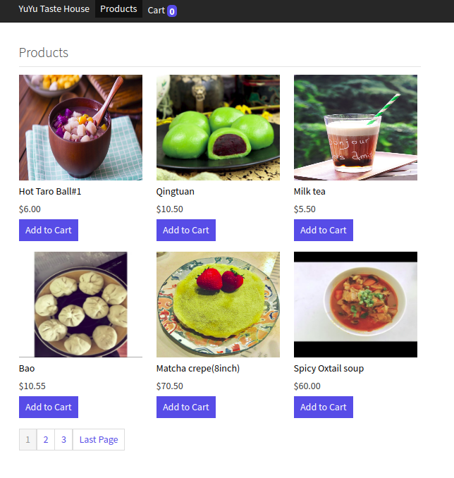
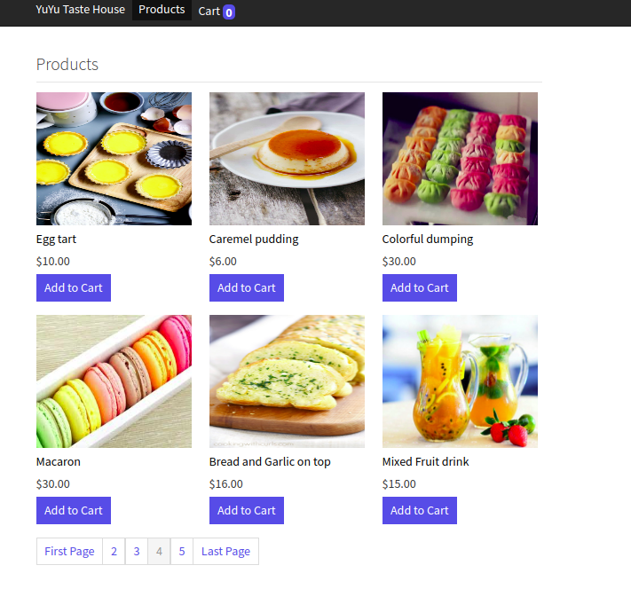
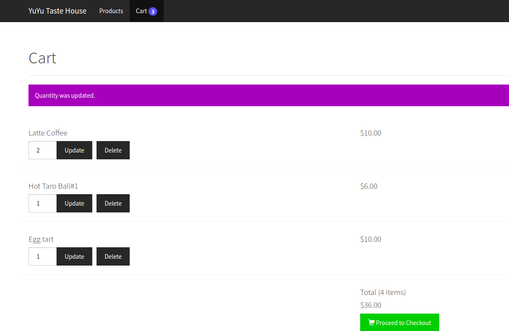

# E-Commerce website
Use boostrap,jQuery, php, mySQl.
[CSS CLASS]

### Display products
1.products.php 
Define $db, $page_title, $product, $product_image, $cart_item, $action, $page, 
$records_per_page, $from_record_num, $page_url, $total_rows  
call function: read($from_record_num, $records_per_page),  rowCount(), count()  

2.objects/product.php 
Implement read($from_records_num, $records_per_page), count(), readByIds($ids) <nr />

3.objects/product_image.php 
Implement readFirst() 

4.read_products_temp.php 
class:m-b-20px  product-id  product-link m-b-10px w-100-pct product-name w-1-pct 
$product_image  product_id  $id user_id  $cart_tiem  
call readFirst()  

5.pagination.php 
class:col-md-12 pagination(bootstrap) m-b-20px m-t-0px  
Define $cart_count $total_pages  $range  $page_url  $page 

******************************************************************

Thanks for your attention.
Please link here.

skype
live:.cid.181e4b1a2c680a50

mail
david.ss88112@gmail.com

telegram
@FullStack_BlockChain

******************************************************************
